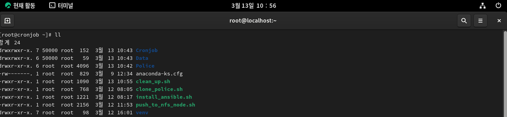

# Market Monitoring with Ansible and Airflow

- Ansible을 활용하여 인프라 구축을 자동화한다.
- Airflow를 사용하여 서로 다른 시간에 수행되어야 하는 테스크를 분산하여 자동화한다.

## 1. Ansible installation
- OS 별 Ansible 설치 방법을 정리한다.
- Ansible을 설치한 후, Playbook을 적용하여 인프라 구축을 자동화한다. (Ubuntu, Rocky Linux 에 설치 Ansible 방법 정리)

### (1) Ansible과 필요 패키지 설치
- 깃을 통해 호스트 PC에서 작업했던 yaml 파일을 git repository를 통해 Node에 위치시킨다.
- Rocky OS 기준 설명

```
# EPEL (Extra Packages for Enterprise Linux) 저장소 : 기업용 리눅스를 위한 추가 패키지
dnf install -y epel-release

# Ansible ro9 
dnf install -y ansible

# Ansible ro10
dnf install -y ansible-core

# ssh pass
dnf install -y sshpass

# 깃 설치
dnf install -y git
```

- Shell Script를 사용하여 자동화를 간편하게 합니다.
- 리눅스에서 `/root` 디렉토리에 `vi install_ansible.sh`를 추가하고, 아래의 내용을 넣는다. 

```
#!/bin/bash

# 1. 루트 권한 확인
if [ "$EUID" -ne 0 ]; then
  echo "오류: 이 스크립트는 sudo 또는 root 권한으로 실행해야 합니다."
  exit 1
fi

echo "--- 시스템 업데이트 및 필수 패키지 설치를 시작합니다 ---"

# 2. EPEL 저장소 설치
echo "[1/4] EPEL 저장소 활성화 중..."
dnf install -y epel-release

# 3. OS 버전 확인 및 Ansible 설치
OS_VER=$(rpm -E %rhel)
echo "감지된 RHEL 메이저 버전: $OS_VER"

if [ "$OS_VER" -eq 9 ]; then
    echo "[2/4] Rocky Linux 9용 Ansible 설치 중..."
    dnf install -y ansible
elif [ "$OS_VER" -eq 10 ]; then
    echo "[2/4] Rocky Linux 10용 Ansible-core 설치 중..."
    dnf install -y ansible-core
else
    echo "경고: 지원 범위를 벗어난 OS 버전입니다. 기본 ansible-core 설치를 시도합니다."
    dnf install -y ansible-core
fi

# 4. SSHPass 및 Git 설치
echo "[3/4] sshpass 설치 중 (비밀번호 인증용)..."
dnf install -y sshpass

echo "[4/4] git 설치 중..."
dnf install -y git

# 5. 설치 결과 확인
echo "--- 설치 완료 확인 ---"
ansible --version | head -n 1
git --version
sshpass -V | head -n 1

echo "모든 패키지가 성공적으로 설치되었습니다."
```

```
# 실행권한
chmod +x install_ansible.sh

# 설치(Ansible, Git)
sudo ./install_ansible.sh
```

### (2) Ansible host 작성 (수동)

- Ansible 설치를 완료한 후 `/etc/ansible/hosts`파일을 열어서 설치할 영역을 설정합니다. 
- IP 규모가 커지면 이 부분도 자동화하는 것을 추천한다.

```
# 호스트
vi /etc/ansible/hosts

# 가장 하단에 아래의 형식을 따라 추가한다.(IP는 각자 다를 수 있다.)
[rocky]
192.168.0.100
192.168.0.101
```

- (필요시) Well-known host 지정이 필요하다.

```
export ANSIBLE_HOST_KEY_CHECKING=False

ssh-keyscan -H 192.168.0.100 192.168.0.101 >> ~/.ssh/known_hosts
```

- Ping test

```
# 모든 호스트
ansible all -m ping -k

# 호스트 지정 rocky
ansible rocky -m ping -k
```

### (3) 호스트 IP 조회

- Ansible Shell 명령어를 사용하여 연결 상태를 확인한다.
- 이 과정에서 연결이 안정적으로 된 것을 확인해야 자동화에 문제가 없다.
- `all` : 모든 영역 / `rocky` : 정의한 영역

```
# 모든 호스트
ansible all -m shell -a "ifconfig" -k

# rocky 그룹 호스트
ansible rocky -m shell -a "ifconfig" -k
```

### (4) 유저 생성

- Master Node에서 모든 도메인 유저를 설정할 수 있다.

```
ansible all -m user -a "name=yslee" -k
```

### (6) Airflow 빌드 및 Project 설치 자동화
- Project clone 과정을 자동화한다. 아래의 두가지 옵션중에서 선택할 수 있다.
- (옵션 1) 아래 깃허브 레파지토리에서 프로젝트를 클론한다.
- (옵션 2) 더욱 간편한 작업을 위하여 Shell Script를 사용한다.
- 리눅스에서 `/root` 디렉토리에 `vi clone_police.sh`를 추가하고, 아래의 내용을 넣는다. 

```
# 수동 방식
git clone -b yslee --single-branch https://github.com/hugingstar/Police.git
```

```
# sh 파일 방식
cd ~
vi clone_police.sh

# 작성한 내용
#!/bin/bash

# 1. 변수 설정
REPO_URL="https://github.com/hugingstar/Police.git"
BRANCH_NAME="yslee"
TARGET_DIR="Police"
PLAYBOOK_PATH="/root/Police/ans_airflow_grafana_build.yaml"

echo "=== 작업 시작: Git Clone 및 Ansible 실행 ==="

# 2. 동일한 이름의 디렉토리가 있는지 확인
if [ -d "$TARGET_DIR" ]; then
    echo "오류: '$TARGET_DIR' 디렉토리가 이미 존재합니다. 작업을 중단합니다."
    exit 1
fi

# 3. git clone 실행
# -b: 특정 브랜치 지정 / --single-branch: 해당 브랜치의 이력만 가져옴
git clone -b $BRANCH_NAME --single-branch $REPO_URL

# 4. Clone 결과 확인
if [ $? -eq 0 ]; then
    echo "성공: [$BRANCH_NAME] 브랜치를 성공적으로 복사했습니다."
else
    echo "실패: Git 클론 도중 문제가 발생했습니다."
    exit 1
fi

# 5. Ansible Playbook 실행
# -k 옵션은 SSH password 입력을 요구하므로 프롬프트가 뜰 때 비밀번호를 입력해야 합니다.
echo "------------------------------------------------"
echo "Ansible Playbook 실행을 시작합니다."
echo "SSH 연결을 위한 비밀번호를 입력해주세요 (-k 옵션)."
echo "------------------------------------------------"

ansible-playbook $PLAYBOOK_PATH -k

# 6. Ansible 실행 결과 확인
if [ $? -eq 0 ]; then
    echo "=== 모든 작업이 성공적으로 완료되었습니다. ==="
else
    echo "실패: Ansible Playbook 실행 중 오류가 발생했습니다."
    exit 1
fi
```

```
# 실행 권한 부여
chmod +x clone_police.sh

# 실행
./clone_police.sh
```

#### Step2 (Install): 

- 이 과정에서는 Police라는 프로젝트를 clone이 완료된 상태이다. 
- 인프라 구축을 위한 기본적인 프로그램을 설치한다.

(1) Firewall > (2) Docker install > (3) Postgres installation on linux

```
ansible-playbook Police/ansinfra_process.yaml -k
```

#### Step3 (Containers): 

- 이 과정에서는 Airflow 빌드 및 모듈 셋팅과정을 자동화한다.

(4) Postgres server using docker > (5) Runnning Airflow > (6) Python files move to dags folder

```
ansible-playbook Police/ansinfra_airflow_build.yaml -k
```

#### Step4 (Daily Analysis):

- Airflow 웹 페이지에 들어가서 Activate 상태를 확인하면서 Task의 데이터 Pipeline이 설정한 시간에 올바르게 작동하는지를 확인한다.


#### Step5 NFS Node로 분석 결과 표출

- 분석 결과는 NFS로 표출하여 향후 쿠버네티스 인프라와 연결될 수 있도록 한다.
- `push_to_nfs_node.sh`를 생성하여 nfs 서버 환경 설정 자동화한다.

```
# push_to_nfs_node.sh 파일 생성
vi push_to_nfs_node.sh

# 작성한 내용
#!/bin/bash

# 1. nfs-utils 설치
echo "NFS 유틸리티를 설치합니다..."
dnf install -y nfs-utils

# 2. 공유 설정 정의 (경로와 옵션을 1:1로 매칭)
# 형식: "경로|옵션"
# 나중에 특정 경로의 IP나 권한만 바꾸고 싶다면 이 리스트에서 해당 줄만 수정하세요.
CONFIGS=(
    "/root/Data/KOSPI/A1Sheet|10.15.0.170(rw,sync,no_root_squash)"
    "/root/Data/KOSPI/B1Sheet|10.15.0.170(rw,sync,no_root_squash)"
    "/root/Data/KOSDAQ/A1Sheet|10.15.0.170(rw,sync,no_root_squash)"
    "/root/Data/KOSDAQ/B1Sheet|10.15.0.170(rw,sync,no_root_squash)"
    "/root/Data/NASDAQ/A1Sheet|10.15.0.170(rw,sync,no_root_squash)"
    "/root/Data/NASDAQ/B1Sheet|10.15.0.170(rw,sync,no_root_squash)"
    "/root/Data/NYSE/A1Sheet|10.15.0.170(rw,sync,no_root_squash)"
    "/root/Data/NYSE/B1Sheet|10.15.0.170(rw,sync,no_root_squash)"
)

echo "디렉토리 생성 및 /etc/exports 설정을 시작합니다..."

for entry in "${CONFIGS[@]}"; do
    # 파이프(|) 기호를 기준으로 경로와 옵션을 분리합니다.
    SHARE_DIR="${entry%%|*}"
    NFS_OPTION="${entry##*|}"

    # 디렉토리 생성 (없을 경우)
    if [ ! -d "$SHARE_DIR" ]; then
        echo "디렉토리 생성 중: $SHARE_DIR"
        mkdir -p "$SHARE_DIR"
    fi

    # /etc/exports 설정 추가 (정확한 매칭을 위해 경로와 옵션을 합쳐서 체크)
    EXPORT_LINE="$SHARE_DIR $NFS_OPTION"
    
    # 이미 해당 경로에 대한 설정이 있는지 확인 (경로명으로 검색)
    if ! grep -qF "$SHARE_DIR" /etc/exports; then
        echo "설정 추가: $EXPORT_LINE"
        echo "$EXPORT_LINE" | sudo tee -a /etc/exports > /dev/null
    else
        echo "이미 설정이 존재하여 건너뜁니다: $SHARE_DIR"
        # 팁: 기존 설정을 덮어쓰고 싶다면 여기서 sed 등을 사용해 교체할 수 있습니다.
    fi
done

# 3. 설정 적용
echo "NFS 수출 테이블을 갱신합니다..."
exportfs -rav

# 4. 서비스 시작 및 활성화
echo "NFS 서버 서비스를 시작하고 활성화합니다..."
systemctl enable --now nfs-server

echo "모든 NFS 경로 설정이 완료되었습니다."
```

```
# 실행 권한 부여
chmod +x push_to_nfs_node.sh

# 실행
./push_to_nfs_node.sh
```

- NFS Client 측(10.15.0.170)에서 설정하는 방법

```
# 파일 생성
vi mount_from_airflow.sh

# 작성한 내용
#!/bin/bash

echo ">>> NFS 마운트를 시작합니다..."

# 1. 마운트될 폴더들 생성 (이미 있으면 통과)
mkdir -p /root/nfs_node/Data/KOSPI/A1Sheet /root/nfs_node/Data/KOSPI/B1Sheet
mkdir -p /root/nfs_node/Data/KOSDAQ/A1Sheet /root/nfs_node/Data/KOSDAQ/B1Sheet
mkdir -p /root/nfs_node/Data/NASDAQ/A1Sheet /root/nfs_node/Data/NASDAQ/B1Sheet
mkdir -p /root/nfs_node/Data/NYSE/A1Sheet /root/nfs_node/Data/NYSE/B1Sheet

# 2. KOSPI 마운트
mount -t nfs 10.17.0.2:/root/Data/KOSPI/A1Sheet /root/nfs_node/Data/KOSPI/A1Sheet
mount -t nfs 10.17.0.2:/root/Data/KOSPI/B1Sheet /root/nfs_node/Data/KOSPI/B1Sheet

# 3. KOSDAQ 마운트
mount -t nfs 10.17.0.2:/root/Data/KOSDAQ/A1Sheet /root/nfs_node/Data/KOSDAQ/A1Sheet
mount -t nfs 10.17.0.2:/root/Data/KOSDAQ/B1Sheet /root/nfs_node/Data/KOSDAQ/B1Sheet

# 4. NASDAQ 마운트
mount -t nfs 10.17.0.2:/root/Data/NASDAQ/A1Sheet /root/nfs_node/Data/NASDAQ/A1Sheet
mount -t nfs 10.17.0.2:/root/Data/NASDAQ/B1Sheet /root/nfs_node/Data/NASDAQ/B1Sheet

# 5. NYSE 마운트
mount -t nfs 10.17.0.2:/root/Data/NYSE/A1Sheet /root/nfs_node/Data/NYSE/A1Sheet
mount -t nfs 10.17.0.2:/root/Data/NYSE/B1Sheet /root/nfs_node/Data/NYSE/B1Sheet

echo ">>> 마운트 완료!"
echo "------------------------------------------------------"

# 6. 디스크 상태 확인
df -h | grep "10.17.0.2"
```


# 5. 서비스 종료 및 삭제

- 작업했던 프로젝트 폴더 파일들(DB/Airflow/Grafana/Data 등)을 삭제한다.

```
# 파일 생성
vi clean_up.sh

# 작성한 내용
#!/bin/bash

# /root 디렉토리로 이동
cd /root || exit

echo "--- 특정 서비스 및 네트워크 정리 작업을 시작합니다 ---"

# (1) /root/Police/postgres_server 에서 docker compose down -v 실행
if [ -d "/root/Police/postgres_server" ]; then
    echo "[Step 1] Police PostgreSQL 서버 중지 및 볼륨 삭제 중..."
    (cd /root/Police/postgres_server && docker compose down -v)
else
    echo "[Skip] /root/Police/postgres_server 디렉토리가 존재하지 않습니다."
fi

# (2) /root/Cronjob 에서 docker-compose.yaml 및 override 파일 적용하여 down -v 실행
if [ -d "/root/Cronjob" ]; then
    echo "[Step 2] Cronjob 서비스 중지 및 볼륨 삭제 중..."
    (cd /root/Cronjob && docker compose -f docker-compose.yaml -f docker-compose.override.yaml down -v)
else
    echo "[Skip] /root/Cronjob 디렉토리가 존재하지 않습니다."
fi

# (3) 지정된 특정 네트워크만 삭제 (추가됨)
echo "[Step 3] 트레이딩 관련 특정 네트워크 제거 중..."
networks=(
    "trade_kospi_network"
    "trade_kosdaq_network"
    "trade_nasdaq_network"
    "trade_nyse_network"
)

for net in "${networks[@]}"; do
    if [ "$(docker network ls -q -f name=^${net}$)" ]; then
        docker network rm "$net" && echo "  - $net 삭제 완료"
    else
        echo "  - $net (존재하지 않음)"
    fi
done

# (4) 잔여 파일 및 디렉토리 삭제 (Cronjob, Data, Police)
echo "[Step 4] 잔여 디렉토리(Cronjob, Data, Police) 삭제 중..."
rm -rf Cronjob Data Police

echo "--- 모든 작업이 완료되었습니다 ---"
```

```
# 실행권한
chmod +x clean_up.sh

# 설치(Ansible, Git)
sudo ./clean_up.sh
```

