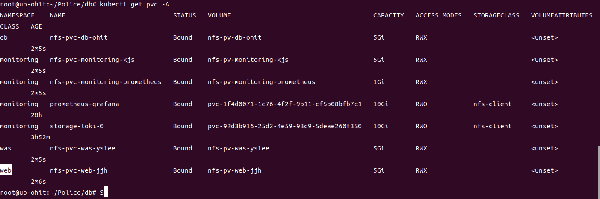

# NFS node 설정 방법

## Ansible 설치
- Ansible playbook을 사용하여 방화벽 해제 및 NFS 설정을 자동화한다.

- Ansible 패키지 설치 자동화 (OS : Rocky9)
- IP 설정은 수동으로 한다.
```
curl -sSL https://raw.githubusercontent.com/hugingstar/Police/refs/heads/yslee/install_ansible.sh | bash
```

- NFS 셋팅을 위한 브랜치 설치

```
git clone -b ohit --single-branch https://github.com/hugingstar/Police.git
```

## 방화벽 해제

- 방화벽을 해제하여 파일에 접근할 수 있는 경로를 열어준다.

```
# 방화벽 해제
ansible-playbook disable_firewall.yaml -k
```

## NFS 파일구조
- NFS를 위한 디렉토리를 만들고, 셋팅 값을 적용한다. 경로별 사용 목적은 아래와 같다.
- 폴더 생성 및 config 설정은 ansible-playbook을 사용한다.
- **NFS 서버 IP** : 10.15.0.170
- **공유 디렉토리**: '/root/nfs_node'

    - 'static' : html과 같은 정적 파일 저장 위치
    - 'was' : python 파일과 같은 동적 파일 저장 위치
    - 'db' : 데이터 베이스 sql 파일 저장 위치
    - 'config' : 그 외 Configuration 파일 저장 위치
    - 'monitoring' : 모니터링 관련 파일 저장 위치
    - 'Data/KOSPI/A1Sheet' : 데이터 분석 결과 파이프라인 KOSPI 1종목당 분석 결과
    - 'Data/KOSPI/B1Sheet' : 데이터 분석 결과 파이프라인 KOSPI 1일 종목 요약
    - 'Data/KOSDAQ/A1Sheet' : 데이터 분석 결과 파이프라인 KOSDAQ 1종목당 분석 결과
    - 'Data/KOSDAQ/B1Sheet' : 데이터 분석 결과 파이프라인 KOSDAQ 1일 종목 요약
    - 'Data/NASDAQ/A1Sheet' : 데이터 분석 결과 파이프라인 NASDAQ 1종목당 분석 결과
    - 'Data/NASDAQ/B1Sheet' : 데이터 분석 결과 파이프라인 NASDAQ 1일 종목 요약
    - 'Data/NYSE/A1Sheet' : 데이터 분석 결과 파이프라인 NYSE 1종목당 분석 결과
    - 'Data/NYSE/B1Sheet': 데이터 분석 결과 파이프라인 NYSE 1일 종목 요약

```
# NFS Setting
ansible-playbook create_directories.yaml -k
```

- `vi /etc/exports` 안에 설정된 내용 : 

```
# 자동으로 설정된 값
/root/nfs_node *(rw,sync,no_subtree_check,no_root_squash)
```

## 방화벽, exports 셋팅 자동화

- 위에서 수행된 과정이 귀찮을 수 있으니 ansible-playbook을 사용하여 낮춘다.

```
cd /root/Police/nfs_node
ansible-playbook nfs_set_auto.yaml -k
```

## Airflow Node와의 연동 (Mount 자동화)

- 일일 분석 결과를 제공하는 Airflow node와의 연동
- 권한을 부여한 후에 실행한다.

```
cd /root/nfs_node

# 권한 부여
chmod +x mount_from_airflow.sh

# 마운트
./mount_from_airflow.sh
```

## Github 브랜치별 Crontab 적용
- 설정한 시간이 지났을 때 `locate_branch.sh`를 실행하여 최신 깃허브 유지
- 권한을 부여한 후에 crontab까지 실행한다.

```
cd /root/nfs_node

# 권한 부여
chmod +x locate_branch.sh

# 1회성 실행
./locate_branch.sh

# 반복적 실행 (로그 파일이 생성되면서 )
crontab -e
*/10 * * * * /root/Police/nfs_node/locate_branch.sh >> /root/locate_branch.log 2>&1

# crond 상태 확인
systemctl status crond

# 생성된 로그 파일
tail -10f /root/locate_branch.log
```

